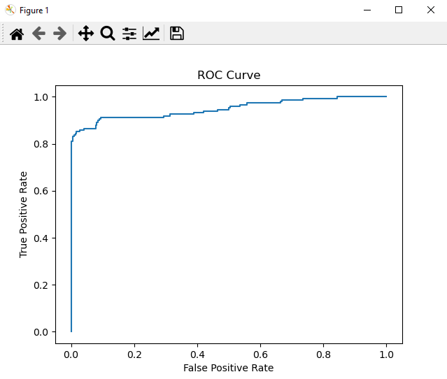
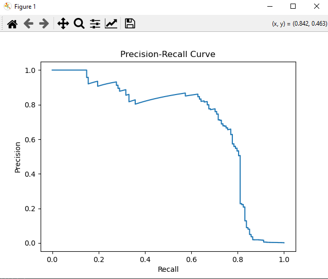
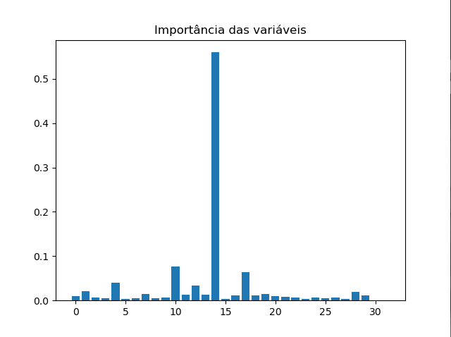
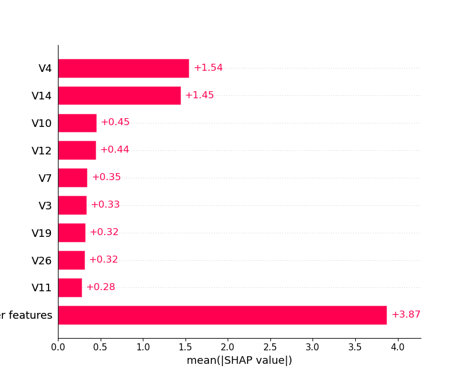

# 💳 Projeto: Detecção de Fraudes em Cartões de Crédito com Machine Learning

Este projeto aborda um dos problemas mais desafiadores e importantes nas instituições financeiras: a detecção de fraudes em transações bancárias. O objetivo é construir um pipeline de Machine Learning capaz de identificar transações fraudulentas de alta precisão, lidando com o extremo desbalanceamento dos dados.

🚀 **[Clique aqui para acessar e baixar o código Python completo](SCRIPTS/Detecçao_de_fraudes_bancarias.py)**

---

## 🛠️ Arquitetura e Explicação Passo a Passo do Código
O desenvolvimento do projeto foi dividido em etapas lógicas, cobrindo desde a importação de dados até a explicabilidade do modelo final.

## 🏁 Conclusão do Projeto

Este pipeline demonstra a construção completa de um sistema antifraude. Saímos de uma análise inicial severamente prejudicada pelo desbalanceamento de dados e evoluímos para um modelo avançado (`XGBoost`), otimizado via `GridSearchCV` focado em **Recall**, estruturado de forma limpa através de **Pipelines** e totalmente auditável graças ao **SHAP**.

## 📊 Visualização dos Resultados e Performance do Modelo

Abaixo estão os gráficos gerados durante a validação do pipeline antifraude, demonstrando o comportamento do modelo e a explicabilidade das decisões:

### 📈 Curva ROC (Receiver Operating Characteristic)

### 📉 Curva Precision-Recall

### 🌲 Importância das Variáveis (Feature Importance)

### 🔮 Explicabilidade do Modelo com SHAP

